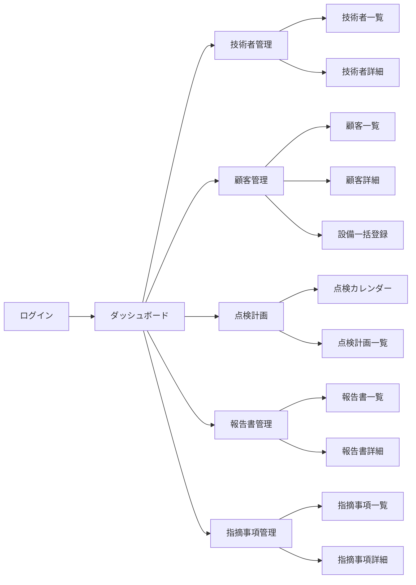
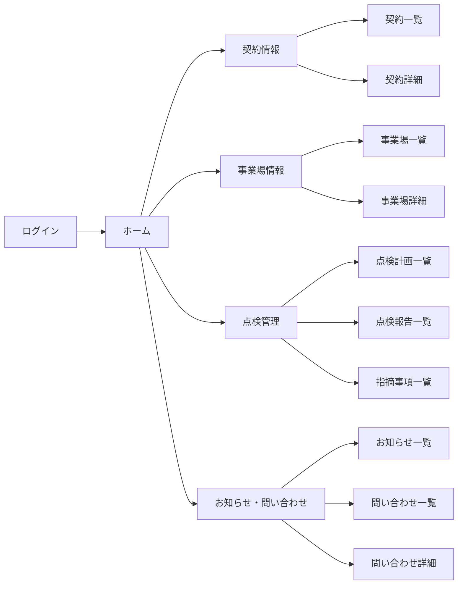
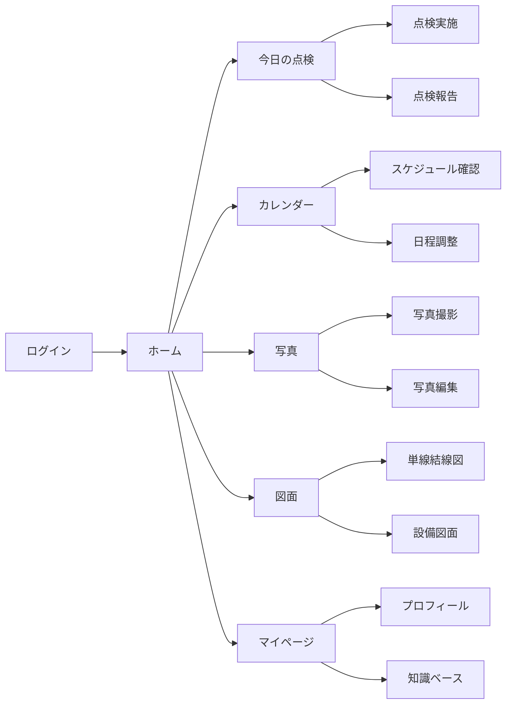

# 電気保安管理システム (Electric Safety Management System)

電気保安管理基幹システムのプロトタイプです。このシステムは、電気設備の保安管理業務を効率化し、一元管理するためのプラットフォームを提供します。

## システム概要

本プロジェクトは、保安管理基幹システムの開発を目的としています。主な概要は以下の通りです。

- 現在のSalesforceを利用した複数ツールの運用から脱却し、システムを統合することで、ミスや漏れを防ぎ、管理工数を大幅に削減します。
- 必要な権限管理を導入し、定例業務および定例外業務（商談、見積り、契約、届出、日程調整、点検実施、点検報告、指摘事項管理、24時間監視、緊急対応）を一元管理することで、業務効率とセキュリティを同時に向上させます。
- 技術者と事業場を合理的にマッチングする機能を開発し、電気保安技術者の時間的・経済的効率を最大化し、成長に貢献します。

## システム構成

システムは以下の3つの主要コンポーネントで構成されています：

```mermaid
graph TD
    A[電気保安管理システム] --> D[管理者向け機能]
    B[顧客ポータル] --> E[顧客向け機能]
    C[点検モバイルアプリ] --> F[技術者向け機能]
    
    D --> G[技術者管理]
    D --> H[顧客管理]
    D --> I[点検計画管理]
    D --> J[報告書管理]
    
    E --> K[契約情報閲覧]
    E --> L[点検報告閲覧]
    E --> M[問い合わせ管理]
    
    F --> N[点検実施]
    F --> O[報告書作成]
    F --> P[写真撮影/編集]
</graph>
```

### 1. 電気保安管理システム（管理者向け）

管理者向けの中核システムで、全体の業務管理を行います。主な機能は以下の通りです：

- 技術者管理：技術者の情報管理、スケジュール管理
- 顧客管理：顧客情報、契約情報、設備情報の管理
- 点検計画：点検スケジュールの作成と管理
- 報告書管理：点検報告書の確認と承認
- 指摘事項管理：点検で発見された問題点の追跡管理



### 2. 顧客ポータル（顧客向け）

顧客が自社の電気設備の点検状況や報告書を確認できるポータルサイトです。主な機能は以下の通りです：

- 契約情報閲覧：契約内容の確認
- 点検予定確認：今後の点検スケジュールの確認
- 点検報告書閲覧：過去の点検結果の確認
- 指摘事項確認：改善が必要な事項の確認
- 問い合わせ管理：問い合わせの送信と履歴確認



### 3. 点検モバイルアプリ（技術者向け）

技術者が現場で使用するモバイルアプリケーションです。主な機能は以下の通りです：

- 点検実施：チェックリストに基づく点検の実施
- 写真撮影/編集：設備の写真撮影と編集
- 報告書作成：点検結果の入力と報告書作成
- スケジュール確認：担当する点検スケジュールの確認
- 知識ベース：点検に関する技術情報の参照



## 画面数

- 電気保安管理システム：103画面
- 顧客ポータル：19画面
- 点検モバイルアプリ：26画面

## 開発環境

- フロントエンド：HTML, Tailwind CSS（プロトタイプ）、Next.js（最終実装）
- モバイルアプリ：Swift（最終実装）

## テスト用アカウント

以下のアカウントでログインできます：

- メールアドレス：test1@info.com, test2@info.com, test3@info.com
- パスワード：pwssowrd1234

## 使用方法

### ローカル環境

1. リポジトリをクローン
2. `index.html` をブラウザで開く
3. システム選択画面から希望するシステムを選択
4. テスト用アカウントでログイン

### GitHub Pages

プロトタイプは GitHub Pages でホスティングされています。以下のURLからアクセスできます：

```
https://kuniatsu.github.io/electric_central_2025/
```

1. 上記URLにアクセス
2. システム選択画面から希望するシステムを選択
3. テスト用アカウントでログイン

## 表示環境

- 電気保安管理システム：PC表示のみ（MacBookAirで最適化）
- 顧客ポータル：PC表示のみ（MacBookAirで最適化）
- 点検モバイルアプリ：SP表示のみ（iPhone16のSafariで最適化）

## 主要機能の説明

### 電気保安管理システム

#### ダッシュボード
管理者向けのメインダッシュボードでは、本日の点検予定、未対応の指摘事項、最近の点検報告などの重要情報を一目で確認できます。

#### 技術者管理
技術者の情報管理、資格管理、スケジュール管理を行います。技術者の稼働状況をグラフで可視化し、最適な人員配置を支援します。

#### 点検計画
点検スケジュールの作成と管理を行います。カレンダー表示で全体の予定を把握し、技術者のアサインを効率的に行えます。

### 顧客ポータル

#### ホーム
顧客向けのホーム画面では、お知らせ、今後の点検予定、最近の点検報告などを確認できます。

#### 点検報告
過去の点検結果を閲覧できます。報告書のPDFダウンロードや、指摘事項の対応状況の確認が可能です。

### 点検モバイルアプリ

#### 点検実施
チェックリストに基づいて点検を実施します。項目ごとに良否判定を行い、必要に応じて写真や詳細情報を記録します。

#### 写真撮影/編集
設備の写真を撮影し、マーカーや文字を追加して問題箇所を明示できます。

#### 単線結線図
電気設備の単線結線図を表示・編集できます。現場での図面確認や修正が可能です。

## 今後の開発予定

- Next.jsを用いたフロントエンド実装
- Swiftを用いたiOSアプリ開発
- バックエンド機能の実装
- データベース連携
